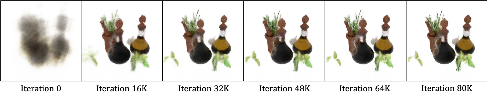

# Neural Radiance Fields (NeRF)

Simplified implementation of Neural Radiance Fields for novel view synthesis based on the paper [NeRF: Representing Scenes as Neural Radiance Fields for View Synthesis](https://arxiv.org/abs/2003.08934). Thanks to [krrish94's repository](https://github.com/krrish94/nerf-pytorch) for assistance.

